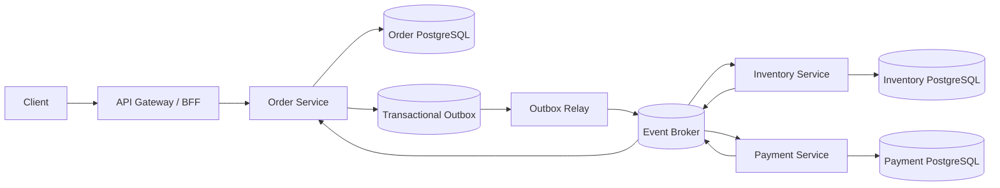

# Node.js Enterprise Training — Concepts 1–4 | Part 2

> **Companion to:** `NodeJS_Training_Concepts_1_to_4_Detailed.md`  
> **Focus:** facilitation plan, senior interviews, enterprise capstone, concept-by-concept labs, and production readiness.  
> **Audience:** Node.js / TypeScript engineers working with Nx monorepo microservices.

## How to use this document

This is a standalone practical companion, not a replacement for the concept explanations in Part 1. Use Section 1 for today’s workshop, Section 2 for senior interviews, Section 3 for the team capstone, Section 4 for the 34 additional enterprise concepts (E01–E34), and Section 5 for production sign-off.

## 1. Today’s 90-minute training session

**Session goal:** each developer can explain the runtime request path, locate code in Nx, implement a small endpoint, and identify one production reliability risk.

| Time | Activity | Trainer action | Participant deliverable |
|---|---|---|---|
| 0–10 min | Baseline knowledge check | Ask how Node.js, Nx and microservices differ; sketch current system | 3 written answers and one architecture question |
| 10–25 min | Runtime and request flow | Walk through event loop, async I/O and controller → service → repository | Request lifecycle sketch |
| 25–40 min | Nx workspace tour | Show apps/libs, project graph, tags and affected builds | Locate a service entry point and shared contract |
| 40–55 min | Live code walkthrough | Trace POST /orders from route to PostgreSQL | Annotated flow including validation and errors |
| 55–70 min | Pair programming | Add request validation, correlation ID and one unit test | Working endpoint and passing test |
| 70–82 min | Failure scenario | Inject duplicate request or dependency timeout | Explain idempotency or timeout mitigation |
| 82–90 min | Review and exit ticket | Collect evidence and assign follow-up | 2 learnings, 1 risk, 1 next action |

### Prerequisites

- Node.js LTS installed, package manager matching repository lockfile, PostgreSQL available locally or in Docker.
- Nx workspace builds and tests successfully; trainer prepares an order-service branch and sample API request.
- No production credentials or customer data are used in demonstrations.

### Trainer demonstration commands

```bash
pnpm nx show projects
pnpm nx graph
pnpm nx test order-service
pnpm nx build order-service
pnpm nx affected -t lint,test,build --base=origin/main --head=HEAD
```

Adapt commands to the repository’s package manager, Nx version and project names. Confirm `origin/main` is the correct CI base.

### Exit criteria (score each 0–2)

| Competency | 0 — not yet | 1 — with help | 2 — independent |
|---|---|---|---|
| Explain event loop and async I/O | Incorrect | Partial | Accurate with example |
| Navigate Nx project graph | Cannot locate | Finds with hints | Explains app/lib dependency |
| Trace request path | Missing layers | Partial | Route → DB → response |
| Write safe endpoint | Not working | Works with gaps | Validated, tested, error-handled |
| Discuss reliability | No failure mode | Names risk | Proposes measurable mitigation |

**Pass target:** 8/10, with no zero in endpoint safety or reliability. Reassess after remediation rather than treating the score as a performance ranking.

## 2. Ten senior-level production interview scenarios

For each scenario ask: **What would you check first? How would you contain the incident? What permanent fix and test would you add?**

### Scenario 1: P95 latency doubles after deployment

**Incident:** API latency rises from 120 ms to 900 ms while CPU remains moderate.

**Expected answer:** Compare per-route latency, traces and deploy markers; check downstream calls, event-loop delay, connection pool waits and query plans. Roll back or disable the regression behind a feature flag; add a regression test.

**Strong-answer signals:** p95/p99, trace spans, pool saturation, query plans, rollback criteria.

**Follow-up prompts:** What metric proves improvement? What could make your fix unsafe? How would you roll back?

### Scenario 2: Duplicate payment after queue retry

**Incident:** A consumer times out after committing payment state, and the broker redelivers the message.

**Expected answer:** Use stable business operation IDs, unique database constraints and atomic state transitions; persist inbox/dedup record transactionally. Acknowledge only after durable success.

**Strong-answer signals:** At-least-once delivery, idempotency, failure between commit and ack.

**Follow-up prompts:** What metric proves improvement? What could make your fix unsafe? How would you roll back?

### Scenario 3: Cross-tenant data exposure

**Incident:** An endpoint returns an order belonging to a different organization.

**Expected answer:** Treat tenant context as trusted only after authentication and authorization; scope every query by tenant; enforce ownership, consider database RLS and cross-tenant tests.

**Strong-answer signals:** Broken object-level authorization, tenant isolation, audit evidence.

**Follow-up prompts:** What metric proves improvement? What could make your fix unsafe? How would you roll back?

### Scenario 4: Nx affected CI skips necessary test

**Incident:** A shared contract changes, but a consuming service was not rebuilt.

**Expected answer:** Inspect Nx project graph and implicit dependencies, code generation outputs, cache inputs and CI base/head. Add contract compatibility checks and validate task graph.

**Strong-answer signals:** Project graph, namedInputs, dependency boundaries, cache correctness.

**Follow-up prompts:** What metric proves improvement? What could make your fix unsafe? How would you roll back?

### Scenario 5: Memory grows until pod restarts

**Incident:** Node.js RSS increases steadily under sustained traffic.

**Expected answer:** Differentiate heap/external/buffer memory, capture heap snapshots and allocation profiles, inspect listeners/timers/caches, reproduce under load and set safe resource limits.

**Strong-answer signals:** Heap versus RSS, leaks, profiling, mitigations.

**Follow-up prompts:** What metric proves improvement? What could make your fix unsafe? How would you roll back?

### Scenario 6: Order stuck in PENDING

**Incident:** Order row commits, but the OrderCreated event is not delivered.

**Expected answer:** Use transactional outbox with worker relay; make consumer idempotent; alert on outbox lag and provide reconciliation tooling.

**Strong-answer signals:** Dual-write failure, outbox, replay, recovery.

**Follow-up prompts:** What metric proves improvement? What could make your fix unsafe? How would you roll back?

### Scenario 7: Cascading failure during dependency outage

**Incident:** Inventory service slows and order-service threads/sockets accumulate.

**Expected answer:** Set end-to-end deadlines, bounded concurrency, circuit breaker, bulkhead, retry budgets and fallbacks; load-test degraded conditions.

**Strong-answer signals:** Timeouts, retry amplification, backpressure, isolation.

**Follow-up prompts:** What metric proves improvement? What could make your fix unsafe? How would you roll back?

### Scenario 8: Zero-downtime database migration

**Incident:** New service version needs a non-null column while old version still runs.

**Expected answer:** Expand schema first, deploy compatible readers/writers, backfill safely, switch usage, verify, then contract later; avoid long locks.

**Strong-answer signals:** Expand-migrate-contract, backward compatibility, rollback.

**Follow-up prompts:** What metric proves improvement? What could make your fix unsafe? How would you roll back?

### Scenario 9: Security incident in webhook endpoint

**Incident:** Forged webhook requests create unauthorized order updates.

**Expected answer:** Verify provider signature over raw body with timestamp tolerance and replay protection; rotate secrets; audit actions; rate-limit and quarantine anomalies.

**Strong-answer signals:** HMAC verification, replay attack, secret rotation.

**Follow-up prompts:** What metric proves improvement? What could make your fix unsafe? How would you roll back?

### Scenario 10: Event loop stalls under burst load

**Incident:** Health checks time out when JSON processing spikes.

**Expected answer:** Measure event-loop delay; identify CPU-bound synchronous work; stream large payloads, batch workloads or move CPU tasks to workers; profile before tuning.

**Strong-answer signals:** Event loop, worker threads, streaming, operational telemetry.

**Follow-up prompts:** What metric proves improvement? What could make your fix unsafe? How would you roll back?

### Interview scoring rubric

| Dimension | 0 | 1 | 2 |
|---|---|---|---|
| Diagnosis | Guesses | Checks one signal | Hypothesis-driven, correlates signals |
| Containment | None | Partial mitigation | Safe rollback/feature flag/rate limit |
| Correctness | Ignores data | Mentions consistency | Handles atomicity, duplicates, boundaries |
| Operations | No visibility | Mentions logs | Metrics, tracing, alerts, runbook |
| Prevention | None | Adds unit test | Integration/fault test and measurable SLO |

**Score:** 0–10 per scenario. A strong senior answer is usually 8+ with no serious security or data-integrity error.

## 3. Enterprise capstone: Event-driven order platform

### Business goal

Build an order-processing platform that accepts orders, reserves inventory, records payments, and publishes order-status changes without losing or duplicating business effects. Implement as independently deployable Node.js + TypeScript services in an Nx monorepo, with PostgreSQL as the durable store and a message broker for asynchronous events.

### Reference architecture



**Note:** A broker may be RabbitMQ, Kafka, SNS/SQS, or another supported transport. Select one and document its actual delivery/ordering guarantees. Services should own their data; separate schemas or databases are acceptable for a local demonstration if access boundaries are enforced.

### Suggested Nx layout

```text
apps/
  api-gateway/
  order-service/
  inventory-service/
  payment-service/
  outbox-relay/
libs/
  contracts/
  observability/
  auth/
  testing/
nx.json
tsconfig.base.json
```

Do not put cross-service business logic or direct access to another service’s database in `libs/`. Shared libraries should contain stable contracts and generic utilities, not a distributed monolith.

### Functional requirements

1. `POST /orders` validates request, authenticates user, checks tenant ownership and accepts an `Idempotency-Key`.
2. `GET /orders/:id` returns tenant-scoped status: `PENDING`, `CONFIRMED`, `FAILED`, or `CANCELLED`.
3. Order and `OrderCreated` outbox record commit in a **single PostgreSQL transaction**.
4. Relay publishes outbox records and retries safely; consumers deduplicate by event ID.
5. Inventory reservation and payment authorization are asynchronous; failures trigger compensating actions.
6. Events carry `eventId`, `eventType`, `version`, `occurredAt`, `correlationId`, and business payload.
7. Health endpoints, structured logs, traces, metrics, and graceful shutdown are implemented.

### Minimum schema

```sql
CREATE TABLE orders (
  id UUID PRIMARY KEY,
  tenant_id UUID NOT NULL,
  status TEXT NOT NULL CHECK (status IN ('PENDING','CONFIRMED','FAILED','CANCELLED')),
  created_at TIMESTAMPTZ NOT NULL DEFAULT now()
 );
CREATE INDEX orders_tenant_created_idx ON orders (tenant_id, created_at DESC, id DESC);
CREATE TABLE idempotency_keys (
  tenant_id UUID NOT NULL,
  key TEXT NOT NULL,
  request_hash TEXT NOT NULL,
  response_body JSONB,
  PRIMARY KEY (tenant_id, key)
 );
CREATE TABLE outbox_events (
  id UUID PRIMARY KEY,
  aggregate_id UUID NOT NULL,
  event_type TEXT NOT NULL,
  payload JSONB NOT NULL,
  published_at TIMESTAMPTZ,
  created_at TIMESTAMPTZ NOT NULL DEFAULT now()
 );
CREATE TABLE inbox_events (
  consumer_name TEXT NOT NULL,
  event_id UUID NOT NULL,
  processed_at TIMESTAMPTZ NOT NULL DEFAULT now(),
  PRIMARY KEY (consumer_name, event_id)
 );
```

### Example API contract

```http
POST /orders HTTP/1.1
Authorization: Bearer <token>
Idempotency-Key: 5a3c-order-001
Content-Type: application/json

{"items":[{"sku":"SKU-1","quantity":2}]}
```

```json
{"orderId":"uuid","status":"PENDING"}
```

Return `201 Created` when the order resource is durably created (even if fulfillment remains pending). Use `202 Accepted` only when creation itself is deferred and the response contract reflects that.

### Delivery milestones

| Sprint | Deliverables | Acceptance gate |
|---|---|---|
| 1 | Nx services, API contracts, auth/validation, PostgreSQL migrations | API + unit/integration tests green |
| 2 | Outbox, broker, inbox dedup, inventory and payment handlers | Duplicate delivery and crash-recovery tests green |
| 3 | Compensation, traces, metrics, retries, timeouts, DLQ/replay | Failure-injection and observability demo |
| 4 | CI affected builds, security checks, deploy strategy, runbooks | Production readiness review signed off |

### Required failure-injection tests

- Retry the same POST concurrently with identical and mismatched idempotency payloads.
- Kill the API after database commit but before response; verify one order and recoverable response semantics.
- Kill the relay after publish but before marking outbox published; verify consumer deduplication.
- Delay inventory responses and verify deadlines and bounded retries.
- Simulate payment failure and verify compensation or manual-reconciliation state.
- Attempt cross-tenant order access and verify denial and audit log.

### Capstone assessment (100 points)

| Area | Points | Evidence |
|---|---:|---|
| Correctness and API design | 20 | Contracts, validation, tests |
| Distributed reliability | 25 | Outbox, idempotency, compensation, fault tests |
| Security and tenant isolation | 15 | Auth checks, negative tests, secret handling |
| Observability and operability | 15 | Traces, metrics, dashboards, runbook |
| Nx architecture and CI | 15 | Project graph, boundaries, affected pipeline |
| Documentation and demo | 10 | Architecture decision records and walkthrough |

**Release gate:** ≥80/100 and zero critical security/data-integrity failures.

## 4. Practical exercises and review criteria for every enterprise concept

These E01–E34 concepts are the additional enterprise topics introduced in Part 1. Each exercise has observable evidence; reviewers should request a pull request, test result, or demo, not only a verbal explanation.

### E01. AsyncLocalStorage and request context

**Module:** Node.js Runtime.

**Exercise:** Propagate requestId across controller → service → repository using AsyncLocalStorage.

**Review / acceptance criteria:** Concurrent requests retain distinct IDs; tests prove no context leakage.

**Reviewer prompts:** Explain failure behavior, test coverage, operational visibility, and one trade-off.

**Evidence to submit:** Code/PR link, automated test output, and a short design note.

### E02. AbortController and cancellation

**Module:** Node.js Runtime.

**Exercise:** Cancel a slow outbound HTTP request using AbortSignal.timeout and handle cancellation.

**Review / acceptance criteria:** Timeout returns controlled error and frees resources; no orphan request.

**Reviewer prompts:** Explain failure behavior, test coverage, operational visibility, and one trade-off.

**Evidence to submit:** Code/PR link, automated test output, and a short design note.

### E03. HTTP connection pooling and keep-alive

**Module:** Node.js Runtime.

**Exercise:** Configure an outbound HTTP client with bounded connections and keep-alive; benchmark.

**Review / acceptance criteria:** Connection count and latency are measured; idle connections close safely.

**Reviewer prompts:** Explain failure behavior, test coverage, operational visibility, and one trade-off.

**Evidence to submit:** Code/PR link, automated test output, and a short design note.

### E04. Event-loop lag and utilization

**Module:** Node.js Runtime.

**Exercise:** Add event-loop delay metrics and simulate blocking CPU work.

**Review / acceptance criteria:** Alert threshold and before/after p95 delay documented.

**Reviewer prompts:** Explain failure behavior, test coverage, operational visibility, and one trade-off.

**Evidence to submit:** Code/PR link, automated test output, and a short design note.

### E05. Heap snapshots and memory leak investigation

**Module:** Node.js Runtime.

**Exercise:** Introduce a deliberate listener leak and identify it using heap snapshots.

**Review / acceptance criteria:** Root cause found and memory stabilizes after fix.

**Reviewer prompts:** Explain failure behavior, test coverage, operational visibility, and one trade-off.

**Evidence to submit:** Code/PR link, automated test output, and a short design note.

### E06. Stream backpressure and pipeline

**Module:** Node.js Runtime.

**Exercise:** Process a large CSV with stream.pipeline and a slow writable destination.

**Review / acceptance criteria:** Bounded memory and error propagation demonstrated.

**Reviewer prompts:** Explain failure behavior, test coverage, operational visibility, and one trade-off.

**Evidence to submit:** Code/PR link, automated test output, and a short design note.

### E07. Worker threads vs child processes vs Lambda

**Module:** Node.js Runtime.

**Exercise:** Compare CPU-bound hashing in main thread vs worker threads.

**Review / acceptance criteria:** Event-loop responsiveness and worker lifecycle measured.

**Reviewer prompts:** Explain failure behavior, test coverage, operational visibility, and one trade-off.

**Evidence to submit:** Code/PR link, automated test output, and a short design note.

### E08. Runtime upgrades and compatibility

**Module:** Node.js Runtime.

**Exercise:** Prepare a Node.js runtime upgrade checklist and run tests against two supported versions.

**Review / acceptance criteria:** Compatibility issues and rollback plan recorded.

**Reviewer prompts:** Explain failure behavior, test coverage, operational visibility, and one trade-off.

**Evidence to submit:** Code/PR link, automated test output, and a short design note.

### E09. Contract-first APIs and schema evolution

**Module:** Backend & TypeScript.

**Exercise:** Write an OpenAPI contract for GET /orders and add a backward-compatible field.

**Review / acceptance criteria:** Consumer contract tests pass for both versions.

**Reviewer prompts:** Explain failure behavior, test coverage, operational visibility, and one trade-off.

**Evidence to submit:** Code/PR link, automated test output, and a short design note.

### E10. Runtime validation versus TypeScript types

**Module:** Backend & TypeScript.

**Exercise:** Validate a POST /orders body with a runtime schema validator.

**Review / acceptance criteria:** Malformed values rejected with consistent 400 response.

**Reviewer prompts:** Explain failure behavior, test coverage, operational visibility, and one trade-off.

**Evidence to submit:** Code/PR link, automated test output, and a short design note.

### E11. Idempotent HTTP APIs

**Module:** Backend & TypeScript.

**Exercise:** Implement Idempotency-Key handling for POST /orders.

**Review / acceptance criteria:** Repeated key and payload yields same result; mismatched payload rejected.

**Reviewer prompts:** Explain failure behavior, test coverage, operational visibility, and one trade-off.

**Evidence to submit:** Code/PR link, automated test output, and a short design note.

### E12. Timeouts, retries, and retry budgets

**Module:** Backend & TypeScript.

**Exercise:** Add deadline propagation and capped retries to an outbound call.

**Review / acceptance criteria:** Worst-case duration bounded and retry storm prevented.

**Reviewer prompts:** Explain failure behavior, test coverage, operational visibility, and one trade-off.

**Evidence to submit:** Code/PR link, automated test output, and a short design note.

### E13. OAuth2/OIDC security boundaries

**Module:** Backend & TypeScript.

**Exercise:** Validate an OIDC JWT using issuer, audience, expiry and JWKS.

**Review / acceptance criteria:** Forged, expired and wrong-audience tokens rejected.

**Reviewer prompts:** Explain failure behavior, test coverage, operational visibility, and one trade-off.

**Evidence to submit:** Code/PR link, automated test output, and a short design note.

### E14. Multi-tenancy and data isolation

**Module:** Backend & TypeScript.

**Exercise:** Implement tenant-scoped order reads and writes.

**Review / acceptance criteria:** Cross-tenant access tests fail closed.

**Reviewer prompts:** Explain failure behavior, test coverage, operational visibility, and one trade-off.

**Evidence to submit:** Code/PR link, automated test output, and a short design note.

### E15. Transactional outbox pattern

**Module:** Backend & TypeScript.

**Exercise:** Write an order and outbox event in one PostgreSQL transaction.

**Review / acceptance criteria:** Crash between commit and publish does not lose event.

**Reviewer prompts:** Explain failure behavior, test coverage, operational visibility, and one trade-off.

**Evidence to submit:** Code/PR link, automated test output, and a short design note.

### E16. API pagination at scale

**Module:** Backend & TypeScript.

**Exercise:** Implement cursor-based pagination over (created_at,id).

**Review / acceptance criteria:** No duplicates or skips under concurrent inserts in tested ordering.

**Reviewer prompts:** Explain failure behavior, test coverage, operational visibility, and one trade-off.

**Evidence to submit:** Code/PR link, automated test output, and a short design note.

### E17. Secure file and webhook handling

**Module:** Backend & TypeScript.

**Exercise:** Verify webhook signature on raw request bytes and enforce replay window.

**Review / acceptance criteria:** Tampered and replayed events rejected; valid event accepted.

**Reviewer prompts:** Explain failure behavior, test coverage, operational visibility, and one trade-off.

**Evidence to submit:** Code/PR link, automated test output, and a short design note.

### E18. Project graph and enforceable boundaries

**Module:** Nx Monorepo.

**Exercise:** Add Nx module-boundary tags to prevent service-to-service internal imports.

**Review / acceptance criteria:** Lint catches forbidden imports.

**Reviewer prompts:** Explain failure behavior, test coverage, operational visibility, and one trade-off.

**Evidence to submit:** Code/PR link, automated test output, and a short design note.

### E19. Buildable versus publishable libraries

**Module:** Nx Monorepo.

**Exercise:** Extract shared contracts into a buildable library without service internals.

**Review / acceptance criteria:** Build dependency chain works and API remains narrow.

**Reviewer prompts:** Explain failure behavior, test coverage, operational visibility, and one trade-off.

**Evidence to submit:** Code/PR link, automated test output, and a short design note.

### E20. Nx affected CI and remote caching

**Module:** Nx Monorepo.

**Exercise:** Run affected tests/builds for a shared-lib change and compare cache hits.

**Review / acceptance criteria:** All dependents included and CI outputs reproducible.

**Reviewer prompts:** Explain failure behavior, test coverage, operational visibility, and one trade-off.

**Evidence to submit:** Code/PR link, automated test output, and a short design note.

### E21. Release independence in a monorepo

**Module:** Nx Monorepo.

**Exercise:** Deploy order-service independently from user-service in a simulated release.

**Review / acceptance criteria:** Unchanged services do not require deployment.

**Reviewer prompts:** Explain failure behavior, test coverage, operational visibility, and one trade-off.

**Evidence to submit:** Code/PR link, automated test output, and a short design note.

### E22. Dependency and supply-chain security

**Module:** Nx Monorepo.

**Exercise:** Add lockfile checks, dependency auditing and secret scanning to CI.

**Review / acceptance criteria:** Pipeline blocks a deliberately unsafe dependency or leaked test secret.

**Reviewer prompts:** Explain failure behavior, test coverage, operational visibility, and one trade-off.

**Evidence to submit:** Code/PR link, automated test output, and a short design note.

### E23. Monorepo developer experience at scale

**Module:** Nx Monorepo.

**Exercise:** Document local startup and one-command test workflow.

**Review / acceptance criteria:** New developer can run target service with minimal manual steps.

**Reviewer prompts:** Explain failure behavior, test coverage, operational visibility, and one trade-off.

**Evidence to submit:** Code/PR link, automated test output, and a short design note.

### E24. Service ownership and bounded contexts

**Module:** Microservices.

**Exercise:** Define bounded contexts for orders, inventory and payments.

**Review / acceptance criteria:** Ownership and cross-service contracts clearly documented.

**Reviewer prompts:** Explain failure behavior, test coverage, operational visibility, and one trade-off.

**Evidence to submit:** Code/PR link, automated test output, and a short design note.

### E25. Delivery semantics and consumer deduplication

**Module:** Microservices.

**Exercise:** Process duplicate OrderCreated events using an inbox table.

**Review / acceptance criteria:** Business effect occurs exactly once under duplicate delivery.

**Reviewer prompts:** Explain failure behavior, test coverage, operational visibility, and one trade-off.

**Evidence to submit:** Code/PR link, automated test output, and a short design note.

### E26. Ordering, partitioning, and hot keys

**Module:** Microservices.

**Exercise:** Design partition key strategy for high-volume order events.

**Review / acceptance criteria:** Ordering scope and hot-partition risk explicitly tested.

**Reviewer prompts:** Explain failure behavior, test coverage, operational visibility, and one trade-off.

**Evidence to submit:** Code/PR link, automated test output, and a short design note.

### E27. Saga orchestration versus choreography

**Module:** Microservices.

**Exercise:** Implement compensation for reserve inventory → authorize payment failure.

**Review / acceptance criteria:** Failed workflow ends in consistent, observable state.

**Reviewer prompts:** Explain failure behavior, test coverage, operational visibility, and one trade-off.

**Evidence to submit:** Code/PR link, automated test output, and a short design note.

### E28. Circuit breakers and bulkheads

**Module:** Microservices.

**Exercise:** Add circuit breaker and bounded concurrency to inventory client.

**Review / acceptance criteria:** Dependency outage does not exhaust order-service resources.

**Reviewer prompts:** Explain failure behavior, test coverage, operational visibility, and one trade-off.

**Evidence to submit:** Code/PR link, automated test output, and a short design note.

### E29. Distributed tracing and OpenTelemetry

**Module:** Microservices.

**Exercise:** Instrument gateway → order → inventory with OpenTelemetry.

**Review / acceptance criteria:** Trace and correlation ID connect all spans without leaking secrets.

**Reviewer prompts:** Explain failure behavior, test coverage, operational visibility, and one trade-off.

**Evidence to submit:** Code/PR link, automated test output, and a short design note.

### E30. Event schema governance

**Module:** Microservices.

**Exercise:** Evolve OrderCreated event v1 to v2 with optional field.

**Review / acceptance criteria:** Old consumers continue functioning and schema checks pass.

**Reviewer prompts:** Explain failure behavior, test coverage, operational visibility, and one trade-off.

**Evidence to submit:** Code/PR link, automated test output, and a short design note.

### E31. Eventual consistency and user experience

**Module:** Microservices.

**Exercise:** Return 202 Accepted with status polling for eventual order completion.

**Review / acceptance criteria:** UI distinguishes pending from failed and avoids false success.

**Reviewer prompts:** Explain failure behavior, test coverage, operational visibility, and one trade-off.

**Evidence to submit:** Code/PR link, automated test output, and a short design note.

### E32. Resilience testing and failure injection

**Module:** Microservices.

**Exercise:** Inject broker outage and slow database into local integration tests.

**Review / acceptance criteria:** Retries, DLQ/replay and recovery verified.

**Reviewer prompts:** Explain failure behavior, test coverage, operational visibility, and one trade-off.

**Evidence to submit:** Code/PR link, automated test output, and a short design note.

### E33. Service-level objectives and error budgets

**Module:** Microservices.

**Exercise:** Define availability and latency SLIs with 30-day SLO targets.

**Review / acceptance criteria:** Error-budget calculation and alert rules documented.

**Reviewer prompts:** Explain failure behavior, test coverage, operational visibility, and one trade-off.

**Evidence to submit:** Code/PR link, automated test output, and a short design note.

### E34. Zero-downtime migrations and deployments

**Module:** Microservices.

**Exercise:** Plan an expand/backfill/contract migration for orders table.

**Review / acceptance criteria:** Old and new versions coexist and rollback remains possible.

**Reviewer prompts:** Explain failure behavior, test coverage, operational visibility, and one trade-off.

**Evidence to submit:** Code/PR link, automated test output, and a short design note.

### Lab review rubric (apply to each E01–E34)

| Dimension | Points |
|---|---:|
| Functional behavior demonstrated | 0–3 |
| Negative cases and failure handling | 0–3 |
| Automated tests | 0–2 |
| Clear explanation of trade-offs | 0–1 |
| Logs/metrics/trace or reproducible evidence | 0–1 |

A concept passes at **8/10**, with no unresolved critical security or correctness issue.

## 5. Production-readiness checklist

Use this as a release gate; record evidence, owner, and exceptions for each line.

### Testing and correctness

- [ ] Unit tests cover service logic and error branches.
- [ ] Integration tests cover PostgreSQL migrations, queries, and transactions.
- [ ] Contract tests validate API and event backward compatibility.
- [ ] End-to-end tests cover order creation, fulfillment, failure, and cancellation.
- [ ] Concurrency and idempotency tests cover duplicate HTTP and message delivery.
- [ ] Fault injection covers broker, database, and downstream outages.
- [ ] Load tests report throughput, p50/p95/p99 latency, saturation and error rate.

### Security and privacy

- [ ] JWT/OIDC verification checks signature, issuer, audience, expiry, and key rotation.
- [ ] Authorization is enforced per route, resource and tenant; cross-tenant tests exist.
- [ ] Inputs validated at trust boundaries; SQL queries parameterized.
- [ ] Secrets stored in secret manager; no secrets in logs or repositories.
- [ ] Dependencies, containers and IaC scanned; high-severity findings triaged.
- [ ] TLS in transit and encryption at rest configured as required.
- [ ] Webhooks verify signatures, timestamps, and replay protection.
- [ ] Audit logs capture privileged actions without leaking sensitive data.

### Observability and incident response

- [ ] Structured logs include service name, request/correlation ID and error code.
- [ ] Distributed traces cover HTTP, database and broker interactions.
- [ ] Metrics include request rate, error rate, latency, event-loop delay and pool saturation.
- [ ] Queue depth, oldest-message age, retry count, DLQ size and outbox lag monitored.
- [ ] SLIs/SLOs and actionable alerts are documented.
- [ ] Runbooks define diagnosis, rollback, replay, reconciliation and escalation.
- [ ] Logs/traces exclude tokens, payment data and other protected information.

### Deployment and operational safety

- [ ] Nx dependency boundaries enforced; affected pipeline validated against shared-lib changes.
- [ ] Reproducible builds use locked dependencies and supported Node.js runtime.
- [ ] CI gates lint, typecheck, tests, vulnerability scans and artifact provenance.
- [ ] Database changes follow expand/migrate/contract for rolling deploys.
- [ ] Health/readiness probes and graceful shutdown are tested.
- [ ] Timeouts, bounded retries, circuit breakers and concurrency limits are configured.
- [ ] Broker consumers are idempotent; poison messages go to a monitored DLQ.
- [ ] Feature flags/canary or rolling release and rollback strategy are rehearsed.
- [ ] Backup/restore, disaster recovery and retention requirements are tested.
- [ ] Resource requests/limits and cost forecasts reviewed under expected load.

### Sign-off template

| Gate | Owner | Evidence link | Status (Pass/Fail/Exception) |
|---|---|---|---|
| Testing | | | |
| Security | | | |
| Observability | | | |
| Deployment | | | |
| Architecture | | | |

Any exception needs an owner, documented risk, mitigation, and expiration date.

## Suggested follow-up

- **Tomorrow:** review workshop exit tickets and remediate fundamentals gaps.
- **This week:** pair on E01–E08 and E09–E17, with code reviews.
- **Next week:** Nx governance (E18–E23) and event-driven resilience (E24–E34).
- **Afterward:** complete capstone milestones and run senior interview scenario drills.

---

*Training companion prepared for enterprise Node.js, TypeScript, Nx monorepo, and microservices development.*
