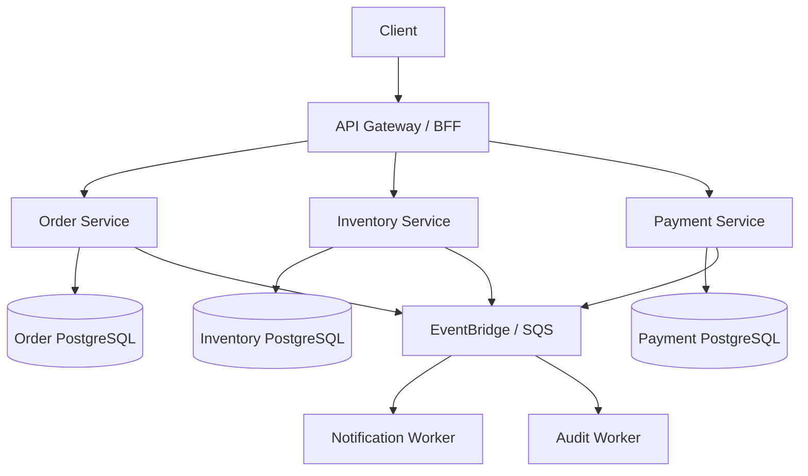

# Part 3 — Enterprise Node.js Production Mastery

**Audience:** Senior backend developers, technical leads, architects  
**Stack:** Node.js, TypeScript, Nx, PostgreSQL, Redis, AWS  
**Scope:** Advanced extension of Concepts 1–4, with 96 concepts, eight practical labs, an enterprise capstone, and interview scenarios.

## Module 1 — Advanced Node.js Internals and Debugging

1. V8 engine architecture, JIT compilation, and garbage collection
2. Event loop internals, starvation, and event-loop lag
3. libuv, thread pool, and asynchronous I/O
4. Heap, stack, external memory, and memory leaks
5. Heap snapshots, CPU profiling, and flame graphs
6. Worker Threads vs Child Processes vs Cluster
7. AsyncLocalStorage and request context propagation
8. Streams, backpressure, and high-volume data processing
9. AbortController, cancellation, and request deadlines
10. Graceful shutdown and resource cleanup
11. Node.js diagnostic reports and production troubleshooting
12. Performance hooks, benchmarking, and event-loop utilization

**Practical lab:** Diagnose and fix an API suffering from high latency, memory growth, and event-loop blocking. Capture baseline metrics, reproduce the issue, profile it, implement a fix, and show before/after results.

## Module 2 — Distributed Systems and Fault Tolerance

13. CAP theorem and distributed consistency models
14. Strong vs eventual consistency
15. Circuit breaker, bulkhead, and timeout patterns
16. Retry storms, exponential backoff, and jitter
17. Idempotency and effectively-once business processing
18. Transactional outbox and inbox patterns
19. Saga orchestration vs choreography
20. Distributed locks and fencing tokens
21. Message ordering, deduplication, and replay
22. Dead-letter queues and poison message handling
23. Event schema versioning and backward compatibility
24. Failure injection and chaos engineering

**Practical lab:** Build an event-driven order workflow that survives duplicate messages, service failures, and delayed events. Demonstrate safe retries and recovery from a dead-letter queue.

## Module 3 — Enterprise API and Database Engineering

25. REST API maturity and contract-first design
26. OpenAPI and consumer-driven contract testing
27. REST vs GraphQL vs gRPC
28. API versioning and backward compatibility
29. Cursor-based pagination and high-volume queries
30. PostgreSQL execution plans and `EXPLAIN ANALYZE`
31. Indexing, partitioning, and query optimization
32. Transaction isolation, deadlocks, and locking
33. Connection pooling and pool exhaustion
34. Zero-downtime database migration
35. Multi-tenancy and data isolation
36. Cache consistency and invalidation strategies

**Practical lab:** Optimize a slow PostgreSQL-backed API, explain the query plan, and deploy a backward-compatible schema change using an expand-and-contract migration.

## Module 4 — Nx Monorepo Architecture and Governance

37. Enterprise Nx workspace organization
38. Domain-driven library boundaries
39. Nx project graph and dependency constraints
40. Buildable and publishable libraries
41. Nx affected builds and tests
42. Local and remote caching
43. Independent microservice deployments
44. Custom Nx generators and executors
45. Shared contracts without tight coupling
46. Monorepo CI/CD pipeline optimization
47. Dependency ownership and CODEOWNERS
48. Monorepo vs polyrepo architecture decisions

**Practical lab:** Design an Nx workspace with independently deployable services, enforced library boundaries, project-level tests, and affected CI pipelines.

## Module 5 — Performance, Scalability, and Observability

49. Latency, throughput, and concurrency
50. Load testing with k6 or Artillery
51. CPU-bound vs I/O-bound workloads
52. Horizontal and vertical scaling
53. OpenTelemetry distributed tracing
54. Structured logging and correlation IDs
55. RED and USE monitoring methodologies
56. Prometheus and Grafana fundamentals
57. SLI, SLO, SLA, and error budgets
58. Capacity planning and autoscaling
59. Performance regression testing
60. Production dashboards and alerting

**Practical lab:** Load-test an API, locate the bottleneck using traces and profiles, optimize it, and document before-and-after latency and throughput.

## Module 6 — Enterprise Security and Compliance

61. OWASP API Security Top 10
62. OAuth 2.0, OIDC, and JWT validation
63. RBAC vs ABAC authorization
64. Zero-trust service communication
65. SSRF, prototype pollution, and injection attacks
66. Secrets management and rotation
67. Multi-tenant authorization boundaries
68. HMAC webhook verification and replay protection
69. Dependency scanning and software supply-chain security
70. SBOM, artifact signing, and provenance
71. Threat modeling using STRIDE
72. Security testing and VAPT remediation

**Practical lab:** Threat-model an Express API, identify exploitable vulnerabilities in a safe test environment, implement remediations, and add regression tests.

## Module 7 — Cloud Architecture, Deployment, and Reliability

73. Docker images and multi-stage builds
74. Kubernetes fundamentals and orchestration
75. AWS Lambda vs ECS vs EKS
76. AWS CDK and Infrastructure as Code
77. Blue-green and canary deployments
78. Zero-downtime deployment and rollback
79. Health checks and readiness probes
80. CI/CD security and environment promotion
81. Cloud cost optimization and FinOps
82. Disaster recovery: RPO and RTO
83. Incident management and postmortems
84. Operational runbooks and on-call readiness

**Practical lab:** Deploy an Nx microservice with automated testing, infrastructure as code, health checks, monitoring, and a demonstrated rollback.

## Module 8 — System Design and Engineering Leadership

85. High-level vs low-level system design
86. Domain-driven design and bounded contexts
87. Clean architecture and hexagonal architecture
88. CQRS and event sourcing trade-offs
89. Architecture Decision Records (ADRs)
90. Modular monolith vs microservices
91. Designing for high availability
92. Designing for millions of API requests
93. Technical debt and modernization
94. Code-review standards and quality gates
95. Technical design reviews
96. Mentoring and engineering ownership

**Practical lab:** Design and defend a high-scale, event-driven order management platform, including trade-offs, failure modes, operational costs, and migration strategy.

---

## Enterprise Capstone — Production-Grade Order Processing Platform

**Technologies:** Node.js, TypeScript, Nx, PostgreSQL, Redis, AWS EventBridge/SQS, OpenTelemetry.

### Minimum deliverables

- Nx workspace with clear application/library boundaries and independently deployable services.
- Order, Inventory, and Payment services with separate data ownership.
- Typed HTTP contracts, request validation, authentication, and authorization.
- PostgreSQL transactions, migrations, indexes, and safe connection pooling.
- Event-driven workflows with outbox publication, idempotent consumers, retries, and DLQs.
- Redis caching with explicit invalidation and time-to-live rules.
- Structured logs, correlation IDs, traces, metrics, and actionable alerts.
- Unit, integration, contract, and end-to-end tests.
- CI/CD with affected tasks, dependency scanning, staged rollout, and rollback.
- Architecture Decision Records, operational runbook, and failure-injection evidence.

### Acceptance criteria

1. Duplicate payment events do not create duplicate charges or order transitions.
2. Downstream failures produce bounded retries and recoverable DLQ messages.
3. A service can deploy independently without breaking consumers.
4. Tenant and role permissions are enforced and tested.
5. Every request can be traced across service boundaries.
6. Load tests establish a baseline and demonstrate defined service-level objectives.
7. The team can demonstrate a safe rollback and database compatibility strategy.

---

## Ten Senior-Level Interview Scenarios

1. **High API latency, low CPU:** What would you inspect first? Discuss database waits, downstream latency, connection pools, event-loop delay, and distributed traces.
2. **Duplicate SQS messages:** How do you prevent duplicate business effects? Discuss idempotency keys, unique constraints, and transactional inboxes.
3. **Database pool exhaustion:** How do you diagnose and fix it? Discuss pool metrics, long transactions, connection leaks, and concurrency budgets.
4. **Breaking schema migration:** How would you recover and prevent recurrence? Discuss expand-and-contract migrations and rollback-safe deployments.
5. **Circular Nx dependencies:** How would you redesign libraries? Discuss dependency graph inspection, domain boundaries, and contract extraction.
6. **Memory leak:** How would you reproduce and investigate? Discuss heap snapshots, allocation profiling, retained objects, and regression tests.
7. **Downstream outage:** How do you prevent cascading failures? Discuss deadlines, circuit breakers, bulkheads, and graceful degradation.
8. **Cross-tenant data exposure:** How do you contain and prevent it? Discuss incident response, tenant-scoped queries, authorization, and automated tests.
9. **Lambda cold starts:** What would you optimize? Discuss package size, initialization work, runtime selection, memory configuration, and provisioned concurrency trade-offs.
10. **Tenfold traffic increase:** What would you measure and change? Discuss load models, bottlenecks, scaling, caching, database capacity, and cost.

**Interview scoring (per scenario):** Problem framing (2), diagnosis (2), architecture decision (2), trade-offs (2), testing/operations (2). Total 100 points.

---

## Recommended Ten-Week Delivery Plan

| Phase | Timeline | Focus |
|---|---|---|
| 1 | Weeks 1–2 | Node.js internals and production debugging |
| 2 | Weeks 3–4 | Distributed systems and database engineering |
| 3 | Weeks 5–6 | Nx architecture, performance, security |
| 4 | Weeks 7–8 | Cloud deployment, reliability, system design |
| 5 | Weeks 9–10 | Capstone implementation, incident simulation, architecture review |

## Production-Readiness Checklist

- [ ] APIs have validated inputs, documented contracts, and consistent error handling.
- [ ] Authentication and authorization are tested, including tenant isolation.
- [ ] Database migrations support rolling deployment and rollback strategies.
- [ ] Queue consumers are idempotent, observable, and support safe replay.
- [ ] Retries have bounded attempts, backoff, jitter, and DLQ procedures.
- [ ] Resource limits, timeouts, cancellation, and graceful shutdown are configured.
- [ ] Structured logs, traces, metrics, dashboards, and alerts are operational.
- [ ] Performance and load tests validate expected peak traffic.
- [ ] Unit, integration, contract, end-to-end, and security tests run in CI.
- [ ] Nx dependency boundaries and affected CI are enforced.
- [ ] Dependencies are scanned and secrets are not embedded in code.
- [ ] Deployments support gradual rollout, health checks, and rollback.
- [ ] Runbooks, incident owners, recovery objectives, and ADRs are documented.

**Outcome:** Developers should be able to explain architectural choices, implement services safely, troubleshoot real incidents, and operate production Node.js systems—not merely recall definitions.
